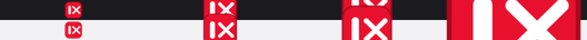

# 关闭右侧标签页 · Brave / Chrome 扩展

一个 MV3 扩展：给浏览器补上「一键关闭右侧所有标签页」。入口做成**醒目的红色图标**，钉到地址栏右边后一眼可见。

Brave 的标签页右键菜单里只有「关闭 / 关闭重复的标签页 / 关闭其他标签页 / 关闭以下标签页」，**没有 Chrome 那样的「关闭右侧标签页」**（垂直标签页下叫「关闭以下标签页」）。本扩展一次补齐五个入口。

---

## 使用方法

### 第 1 步 · 安装（只做一次）

1. 克隆本仓库：

   ```bash
   git clone https://github.com/kylechuuuuu/brave-close-tabs-right.git
   ```

2. 打开 `brave://extensions/`（Chrome 用 `chrome://extensions/`），打开右上角**开发者模式**
3. 点**加载已解压的扩展程序**，选择克隆下来的仓库目录 → 列表里出现「关闭右侧标签页」
4. 以后**改了文件/更新了版本**，在本扩展卡片上点一次**「重新加载」**（改了 `manifest.json` 必须重载才生效）

### 第 2 步 · 把红图标钉到工具栏（强烈推荐，只做一次）

钉住之后红色图标常驻地址栏右边，左键点它就是一键关闭面板：

1. 点地址栏右侧的**拼图图标**（扩展程序菜单）
2. 在列表里找到「**关闭右侧标签页**」，把鼠标移到这一行：
   - 行右侧会出现**图钉**按钮（提示「固定 关闭右侧标签页」）→ 点它；或
   - 点行右侧的「**⋯（更多操作）**」→ 选「**固定到工具栏**」
3. 红图标就固定在工具栏上了；钉住后可以**按住拖动**调整它在工具栏里的位置

> 浏览器不提供「扩展自己固定图标」的 API，所以这一步只能手动点一次（每次重新加载扩展后一般不需要重钉）。

### 第 3 步 · 用哪个入口（五个入口，随场景挑一个）

| # | 入口 | 怎么操作 | 菜单里的位置 |
| --- | --- | --- | --- |
| 1 | **红图标 · 左键** | 点红图标 → 面板里点红色大按钮「✕ 关闭右侧标签页」 | 面板还有「关闭其他标签页」「关闭左侧标签页」 |
| 2 | **红图标 · 右键** | 右键那个红图标 | 第 3 行就是本项（第 1 行是浏览器放的扩展名、第 2 行是分隔线），**原生项全在它下面** |
| 3 | **标签页上右键** | 右键任意标签页 | 在「关闭 / 关闭重复的标签页 / 关闭其他标签页 / 关闭以下标签页」这一组的**上方**（Chromium 固定插槽，见下节） |
| 4 | **网页里右键** | 右键网页空白处 | 在「查看页面源代码 / 检查」**正上方**，即页面菜单的**底部区域** |
| 5 | **快捷键** | `Alt+Shift+Right` 关右侧、`Alt+Shift+O` 关其他 | 不用打开任何菜单，**最快**；改键见下 |

日常最快的两种用法：**① 直接按 `Alt+Shift+Right`**；**② 点一下红图标 → 红色大按钮**。

改快捷键：打开 `brave://extensions/shortcuts`（Chrome：`chrome://extensions/shortcuts`），找到本扩展的两条命令，点输入框按下你想要的组合键即可。

### 它到底会关掉哪些标签页

- 只关**当前窗口**里 `index` 比当前标签页更大的标签页：横排标签=**右边那些**，Brave 垂直标签=**下面那些**；
- 不关当前标签页，也不碰其他窗口的标签页；
- 固定标签页一般排在最左边（index 更小），不会被误关；
- 面板里的「关闭左侧标签页」「关闭其他标签页」是同一套逻辑的另两个方向。

### 常见问题

| 现象 | 原因 / 处理 |
| --- | --- |
| 重启浏览器后菜单项消失了？ | 已修复。MV3 的右键菜单项**不跨会话持久化**（浏览器不把 `menu_items` 写进 profile），本扩展在 service worker 每次启动时都重新注册；早期版本只在 `onInstalled` 注册，所以重启后菜单项会没。 |
| 标签页右键菜单里找不到这一项 | Chromium 特性开关 `kExtensionTabContextMenu`（`brave://flags/#extension-tab-context-menu`）控制标签页菜单里的扩展项，确认不是 `Disabled`，改完重启浏览器。 |
| 想让这一项排在右键菜单**第一个** | 做不到，位置由浏览器写死（见下节）——除非自行编译一份改过源码的浏览器。 |
| 图标不在工具栏上 | 还没「钉」：见上面**第 2 步**。 |
| 用 Brave 垂直标签页 | 垂直标签菜单里有原生「**关闭以下标签页**」，在竖排标签下它和「关闭右侧标签页」是同一件事，不装扩展也有（同样不在菜单最底部）。 |

---

## 关于菜单项的位置（为什么放不到第一个 / 最底部）

这是浏览器写死的，`chrome.contextMenus` 没有 `index` / `priority` 之类的参数，扩展只能「注册一项」，插在哪一格由 Chromium 决定：

- **标签页右键菜单**：Chromium `chrome/browser/ui/tabs/tab_menu_model.cc` 的 `TabMenuModel::Build()` 先把原生项加完，再 `// Append extension items for the 'tab' context if the feature is enabled.` 追加扩展项，**之后**才加 `// Separator Close Tab items` + 关闭 / 关闭其他 / 关闭右侧。所以扩展项永远固定在关闭分组**前面那一格**——既不在最顶部，也不在菜单最底部。
- **Brave 还在末尾追加自己的项**：`BraveTabMenuModel::Build()` 在关闭分组之后又加了「重新打开关闭的标签页」「为所有标签页添加书签…」「显示垂直标签页」等，所以 Brave 的菜单底部永远是浏览器自己的东西。Chrome 没有这些尾巴项，看着才像「扩展项在最底部」。
- **页面右键菜单**：Chromium `chrome/browser/renderer_context_menu/render_view_context_menu.cc` 把扩展项加在开发者项（查看页面源代码 / 检查）**之前** ⇒ 页面菜单里扩展项就在最底部区域（同样放不到顶部）。
- **图标右键菜单**（本扩展的 `contexts: ["action"]` 项）：`chrome/browser/extensions/extension_context_menu_model.cc` 的 `ExtensionContextMenuModel::InitMenuWithFeature()` 里第一行固定是 `AddItem(HOME_PAGE, extension_name)`（扩展名，本扩展没设主页所以是灰的），随后才是 `AppendExtensionItems()`（先插一条分隔线再加扩展自己的项）。所以本项在**第 3 行**：**原生项（固定到工具栏 / 选项 / 移除 / 管理扩展程序…）全部在它下面**——这是扩展能达到的最靠上位置。
- 想把某一项放到某个右键菜单的**第一行**，唯一办法是改浏览器源码自行编译（把上面那个 `AppendExtensionItems()` 调用挪到函数最开头），代价是需要 Brave 全量源码 + 数小时构建，且每次浏览器升级都要重做。

---

## 图标

- 设计：醒目红 `#E8112D` 圆角方块 + 白色图形（左边一条竖条 = 当前标签页，右边 ✕ = 关掉它右边的东西），共 `icons/icon16.png` / `icon32.png` / `icon48.png` / `icon128.png` 四个尺寸。
- 预览（上排深色底、下排浅色底，16 / 32 / 48 / 128 放大约 6 倍）：

  

- 重新生成（需要 Pillow）：

  ```bash
  python tools/make-icons.py
  ```

  脚本用 8 倍超采样后 LANCZOS 降采样，保证 16px 下红块和图形都清晰；同时会在 `%TEMP%\ctr-icon-preview.png` 生成一张深/浅底色对比图，方便检查。

---

## 诊断

点扩展图标，面板底部会显示后台脚本注册菜单项的结果：

- `图标右键: 已注册` / `标签页右键: 已注册` / `页面右键: 已注册` → 扩展侧正常，菜单里看不到是浏览器行为（见上节）
- `失败 → ...` → 真正的注册错误（重复 id、缺 `contextMenus` 权限、上下文名不支持等）

---

## 文件

| 文件 | 作用 |
| --- | --- |
| `manifest.json` | MV3 清单：权限 `contextMenus` + `tabs` + `storage`，图标，popup 面板，两个快捷键命令 |
| `background.js` | service worker：注册图标 / 标签页 / 页面三个菜单项，处理点击与快捷键，写诊断 |
| `common.js` | 共用逻辑（按 `tab.index` 过滤后批量关闭） |
| `popup.html` / `popup.js` | 图标面板（红色主按钮）+ 诊断显示 |
| `icons/icon{16,32,48,128}.png` | 红色图标 |
| `tools/make-icons.py` | 图标生成脚本 |

## 许可

[MIT](LICENSE)
